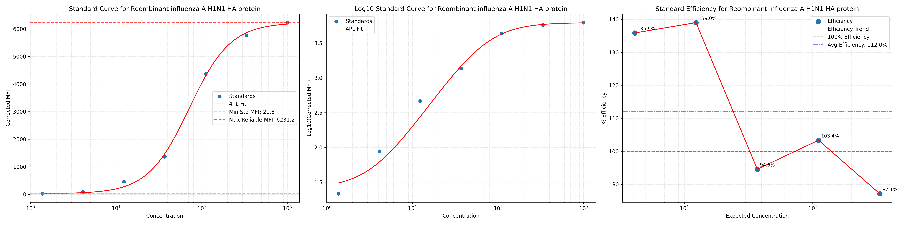
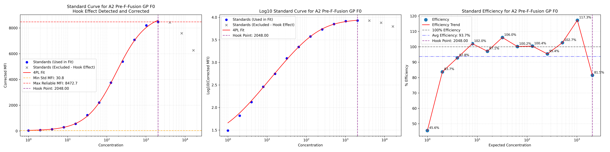

# Luminex Data Extractor

A Python script for processing and analyzing Luminex assay data (currently only tested on Luminex Intelliflex files). This tool enables users to import Luminex CSV output files (e.g. direct exports from Luminex machines), apply a 4-parameter logistic (4PL) standard curve fit, interpolate unknown sample concentrations, and identify additional samples for further dilution/testing.

## Features

- GUI interface for selecting input files and analytes
- Supports standard 4PL curve fitting for each analyte
- Calculates interpolated concentrations for unknowns
- Flags samples that fall outside of fit bounds or show poor fitting
- Hook effect detection and correction
- Generates plots of standard curves with sample points
- Outputs clean, analysis-ready CSV results

## Requirements

- Python 3.8+
- `pandas`
- `numpy`
- `matplotlib`
- `tkinter`
- `scipy`

You can install the required packages using:

```bash
pip install pandas numpy matplotlib scipy
```

> Note: `tkinter` is included in most Python installations by default. On macOS, use `python3 -m tkinter` to test if it's available.

## Installation

Clone this repository:

```bash
git clone https://github.com/asherichia/luminex-data-extractor.git
cd luminex-data-extractor
```

## Input File Format

The script is designed to work with standard CSV exports from Luminex Intelliflex instruments. The file should contain:
- Metadata at the top (automatically removed during preprocessing)
- Data rows with columns like 'Sample', analyte measurements, 'Total Events', etc.
- The script automatically identifies analytes as columns between 'Sample' and 'Total Events'

## Standards File Format

The standards CSV file should contain known concentrations for each standard, formatted as follows:

| Sample    | Concentration | 
|-----------|---------------|
| Standard1 | 1000          |
| Standard2 | 500           |
| Standard3 | 250           | 

- Each row corresponds to a standard sample
- The 'Sample' column must match the standard names in your data file
- If no standards file is provided, the script will attempt to infer concentrations from standard names

## Cut-off Files

Optional inclusion - If there are defined cut-offs established for your assays (e.g., interpolated cut-offs), these can be used to classify samples as positive/negative.

The cut-off file should be a CSV with at least two columns:
- 'Analyte': The name of the analyte (must match the analyte names in your data)
- 'Cutoff': The concentration value below which a sample is considered negative

## Hook Effect Detection

The hook effect is a phenomenon in immunoassays where very high concentrations of analyte can paradoxically result in lower signal readings. This tool can:
- Automatically detect the hook effect in standard curves
- Exclude standards showing the hook effect from curve fitting
- Flag samples that may be affected by the hook effect
- Identify samples that need retesting at lower dilutions

## Usage

Run the script via command line:

```bash
python Luminex_DataExtractor.py
```

This will launch a GUI where you can:
1. Select your Luminex CSV data file
2. Choose the plate format and preprocessing options
3. Provide optional standards and cut-off files
4. Set background sample name and dilution factor
5. Enable/disable hook effect detection
6. Select all analytes or specific ones for analysis
7. Generate output plots and CSV files

## Example Workflow

1. Export data from your Luminex Intelliflex instrument as a CSV file
2. Launch the Luminex Data Extractor tool
3. Load the CSV file and select the appropriate plate format e.g., 96 vs. 384 well and highlighting if a full plate or X number of wells
4. Click "Preprocess File" to extract the data
5. Set analysis options and provide any standards/cut-off files
6. Select "All" or a specific analyte to analyze
7. Click "Run Analysis" to generate results
8. Review the standard curves, concentrations, and sample flags in the output directory
9. Check the samples-to-retest file to identify samples needing dilution

## Output Files

When you run the Luminex Data Extractor, it creates the following directory structure:

```
{output_prefix}_graphs/             # Main output directory
├── analytes/                       # Individual analyte files
│   ├── {analyte}_results.csv       # Individual analyte results
│   └── {analyte}_efficiency.csv    # Efficiency data for each analyte
├── {analyte}_standard_curve.png    # Standard curve plots (for easy viewing)
├── {output_prefix}_combined_results.csv   # Combined results for all analytes
├── {output_prefix}_efficiency_data.csv    # Efficiency data (long format)
├── {output_prefix}_efficiency_pivot.csv   # Efficiency data (pivot table)
├── {output_prefix}_hook_effect_data.csv   # Hook effect information
├── {output_prefix}_samples_to_retest.csv  # Samples needing retesting
└── Unused_data_run_{timestamp}.csv        # Metadata removed from original file
```

### Main Output Files

#### Combined Results File
- **Filename:** `{output_prefix}_combined_results.csv`
- **Description:** Contains all sample results for all analyzed analytes.
- **Key fields:**
  - Sample name and location (if available)
  - `Is_Standard` and `Is_Background` flags
  - For each analyte:
    - `{analyte}_Conc`: Raw concentration
    - `{analyte}_Final_Conc`: Concentration after applying dilution factor
    - `{analyte}_Avg_Efficiency`: Average standard curve efficiency
    - Various sample quality flags (see below)

#### Standard Efficiency Files
- **Filename:** `{output_prefix}_efficiency_data.csv` and `{output_prefix}_efficiency_pivot.csv`
- **Description:** Data showing how well the fitted curve predicts expected standard values.
- **Formats:**
  - Long format: Contains Analyte, Concentration, and Efficiency columns
  - Pivot table: Rows are concentrations, columns are analytes

#### Hook Effect Data
- **Filename:** `{output_prefix}_hook_effect_data.csv`
- **Description:** Information about hook effects detected in each analyte's standard curve.
- **Key fields:**
  - `Analyte`: Name of the analyte
  - `Hook_Detected`: Whether hook effect was detected (True/False)
  - `Hook_Concentration`: Concentration at which hook effect begins
  - `Standards_Excluded`: Number of standards excluded due to hook effect

#### Samples to Retest
- **Filename:** `{output_prefix}_samples_to_retest.csv`
- **Description:** List of samples that need retesting (typically at lower dilutions).
- **Format:** Matrix with samples as rows and analytes as columns. "Yes" indicates retest needed.

#### Unused Data 
- **Filename:** `Unused_data_run_{timestamp}.csv`
- **Description:** Metadata removed from the original file during preprocessing.

### Individual Analyte Files

#### Standard Curve Plots
- **Filename:** `{analyte}_standard_curve.png`
- **Description:** Visual representation of the standard curve for each analyte.
- **Contains:**
  - Standard curve with concentration on x-axis
  - Log10 MFI vs concentration plot
  - Standard efficiency vs concentration plot
  - Hook effect indication (if detected and enabled)

#### Individual Analyte Results
- **Filename:** `analytes/{analyte}_results.csv`
- **Description:** Detailed results for a specific analyte.
- **Key fields:**
  - Sample name and location (if available)
  - Raw MFI values and background-corrected MFI
  - Calculated concentrations (raw and final)
  - Quality flags

#### Analyte Efficiency Data
- **Filename:** `analytes/{analyte}_efficiency.csv`
- **Description:** Efficiency data for each concentration point in the standard curve.

### Sample Quality Flags

The script adds several flags to help identify quality issues:

1. **`{analyte}_Below_Min_MFI`**: Value is 1 if raw MFI is below the lowest standard MFI or negative after background subtraction.
   - For standards: Flag set to NaN (not applicable)
   - For background samples: Flag set to 1 (always considered negative)

2. **`{analyte}_Below_Cutoff`**: Value is 1 if interpolated concentration is below the defined cutoff.
   - For standards: Flag set to NaN (not applicable)
   - For background samples: Flag set to 1 (always considered negative)
   - For samples below Min MFI: Automatically flagged as below cutoff

3. **`{analyte}_Above_Max_MFI`**: Value is 1 if raw MFI is above the highest reliable standard's MFI.
   - For standards and background: Flag set to NaN (not applicable)
   - For samples above Max MFI: Should be rerun with more dilution

4. **`{analyte}_In_Hook_Zone`**: Value is 1 if the sample might be affected by the hook effect.
   - For standards and background: Flag set to NaN (not applicable)
   - For samples in hook zone: May have unreliable interpolated values

## Example PNG plots

Each analyte generates a curve-fit plot saved as `{analyte}_standard_curve.png` showing:
- Standard curve with fitted 4PL curve
- Standard curve with fitted 4PL curve (Log10)
- Efficiency plot for the standard curves

An example output of a normal run, with standards working well and no overfitting:



An example output, whereby 4PL curve is fitted but does not use standards whereby hook effect is observed:



## License

[MIT License](LICENSE)

---

## Author

Ashley Otter  
[GitHub Profile](https://github.com/asherichia)
